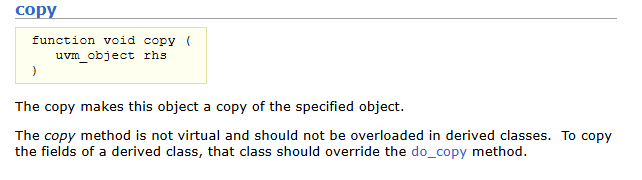
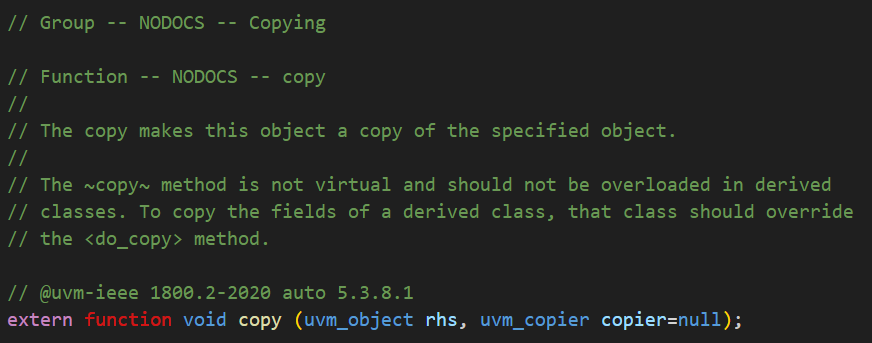

# UVM1800.2/Summary 
UVM继UVM1.2版本之后，由IEEE发布标准，但是IEEE并不提供base class库，还是由 Accellera 组织基于IEEE 1800.2标准开发。IEEE的标准化过程为UVM带来了稳定性。IEEE标准往往变化非常缓慢，每5年左右更新一次。作为一个用户，这意味着当使用UVM 1800.2编写任何新代码时，应该只使用LRM中记录的API调用或变量。如果使用任何其他方法或变量，那么当库实现被重构时，这些方法将面临更改或将被删除的风险。
## The Accellera UVM 1800.2 implementation
Accellera标准组织提供了基于 UVM 1800.2的基础开源库。库中包含了UVM 1800.2的API接口和编译宏定义**UVM_ENABLE_DEPRECATED_API。UVM_ENABLE_DEPRECATED_API**可以让UVM 1800.2代码切换到UVM1.2 API，方便验证人员从UVM1.2迁移到UVM 1800.2. 
Accellera的实现还包含了一些来自UVM 1.2的调试方法，这些方法在IEEE LRM中没有。这些方法由Accellera在其发布文档中进行了记录。
Accellera的代码库还包含一些既没有在1800.2 LRM中记录，也没有被弃用的代码。这类代码可能包括实现已发布API所需的内部代码，或者是某些可能将来成为标准或不成为标准的遗留UVM代码。使用UVM1800.2的原则是尽量使用1800.2 LRM中的内容。

## Migrating to UVM 1800.2
UVM 1.2与UVM 1800.2之间的变化主要是关于引入一些新特性后的导致的。
### 被弃用的classes：
• uvm_utils 
• uvm_port_component_base
• uvm_port_component 
• uvm_sequencer_param_base 
• uvm_random_stimulus 
• uvm_in_order_comparator 
• uvm_in_order_built_in_comparator 
• uvm_in_order_class_comparator

这些class在实际运用中很少被使用。许多方法被弃用或重命名，目的是为了简化代码和API名字。这里无法列出所有的弃用方法，有部分修改或者弃用的代码隐藏在了封装的API中。
之前的UVM代码为了兼容OVM的代码，对OVM的phase名字和UVM的phase名字进行可别名处理。在新的UVM 1800.2中，OVM phase名字被全部弃用。因此，如果你的代码中使用了OVM phase的名字，需要先将这部分代码重构适配UVM名字。

| OVM Phase                           | UVM Phase                                                |
| ----------------------------------- | -------------------------------------------------------- |
| function void bulid();              | function void bulid_phase(uvm_phase phase);              |
| function void connect();            | function void connect_phase(uvm_phase phase);            |
| function void end_of_elaboration(); | function void end_of_elaboration_phase(uvm_phase phase); |
| task run();                         | task run_phase(uvm_phase phase);                         |
| function void report();             | function void report_phase(uvm_phase phase);             |

### uvm_object

所有的uvm_object字段方法（copy(), compare(), print(), pack(), unpack()）现在都接受一个策略对象作为参数。这里的改变是copy()方法现在接受一个uvm_copier策略，而之前它并不需要。uvm_object有一个额外的do_execute_op()方法，这是一个由策略类调用的用户可定义的hook方法。这个方法需要uvm_field_op类，可以通过uvm_copier用来替换或增强各种do_copy、do_compare()等方法。do_execute_op()方法在do_copy()、do_compare()等方法之前被调用。

UVM1.2 copy:



UVM IEEE 1800.2 copy:



### Messaging

以下是在UVM 1.2中引入的类，它们存在于Accellera的代码中，但不在1800.2 LRM中：

• uvm_report_message_element_base 

• uvm_report_message_int_element 

• uvm_report_message_string_element 

• uvm_report_message_object_element 

• uvm_report_message_element_container

这些l类是在UVM组件或对象内部调用后对消息字符串的部分进行操作，这似乎有些多余。建议不要使用这些类。还有一些与uvm_report_object和uvm_report_catcher中的message_elements相关的方法，这些方法同样没有文档记录，因此也不应该使用。

```Verilog
// uvm_report_object and uvm_report_catcher methods not in 1800.2 
get_element_container()  
add_int() 
add_string()  
add_object() 
// Methods deprecated in uvm_report_catcher: 
get_report_catcher()  
print_catcher()
```

### **The Factory**

在1800.2版本中，工厂已经扩展以支持抽象类。这意味着可以将virtual class注册到工厂中。由于virtual class无法被构造，这种类型的工厂条目只能与提供抽象类非抽象扩展的类的覆盖一起使用。如果你在一个抽象类上调用type_id::create()方法，将会导致错误。

这项功能似乎有些多余，甚至可能对UVM测试平台的性能产生负面影响。建议不要使用这个功能。这些是与工厂注册抽象类相关的宏：

```Verilog
`uvm_object_abstract_utils() 
`uvm_object_abstract_param_utils() 
`uvm_component_abstract_utils() 
`uvm_component_abstract_param_utils()
```

### **Event and Barrier Pools**

有两个新的pool类可用于存储event和barriers的集合。两者都是uvm_pool类的特化。这些pool既可以作为global pool使用，也可以作为loclized pools使用。

```Verilog
uvm_event_pool  
uvm_barrier_pool
```

### Sequence

uvm_sequence_base 类已被设为virtual class。这可能会影响那些依赖于创建一个 uvm_sequence_base 作为多态句柄来调用派生序列中方法的序列代码。uvm_sequencer_param_base 类已被删除，其功能已合并到uvm_sequencer_base 类中。除非用户扩展了 uvm_sequencer_param_base 类，否则这一变化不应影响大多数用户。

`uvm_do()宏已经被优化，现在宏的数量减少了，但每个宏的参数更多了。不推荐在任何情况下使用这些宏。

### Policies

所有UVM策略类现在都扩展自一个共同的uvm_policy类，该类包含了一组基础方法用于处理堆栈对象。uvm_policy类还允许向uvm_policy类添加一个扩展对象，这可以用来定制策略。

1800.2引入了一个uvm_copier策略对象，用于copy()方法。

所有的策略类都有额外的访问器方法用于设置和获取策略成员。策略类现在还增加了对遍历对象层次结构的额外支持。实际上，这些变化不会影响默认策略行为。然而，它们有潜力使策略类变得更加灵活。

### Registers 

uvm_path_e 枚举类型已被重命名为 uvm_door_e，且在 UVM 寄存器访问方法中用作默认路径变量的值已从 UVM_DEFAULT_PATH 更改为 UVM_DEFAULT_DOOR。这将影响扩展了这些方法的用户代码。例如，任何扩展了read() 或write() 方法的 uvm_reg 类扩展可能会受到影响。

为了便于支持动态地址映射，现在可以解锁uvm_reg_block和uvm_reg_map，并在重新锁定uvm_reg_block之前，可以在不同地址上注销reg_maps和寄存器并重新添加它们。uvm_reg_item现在对其各种变量有了访问器（set()/get()）方法。

### Miscellaneous

有许多API使用整数作为参数类型，现在这些已经改为使用int，因为这是一个双状态变量。例如：

```Verilog
// UVM 1.2 integer type used 
function integer begin_child_tr(time begin_time = 0, integer parent_handle = 0); 
// UVM 1800.2 int type used 
function int begin_child_tr(time begin_time = 0, int parent_handle =  0);
```


