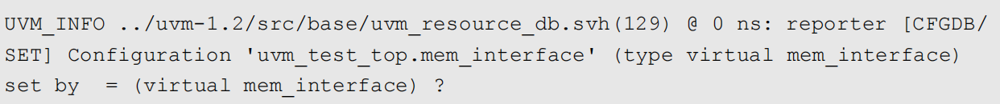
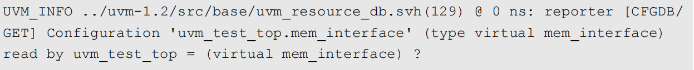
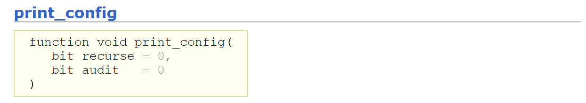
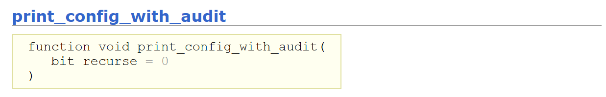
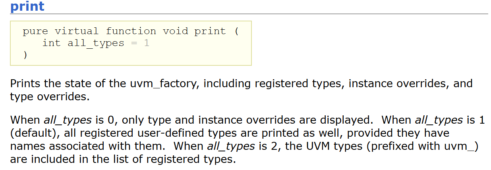
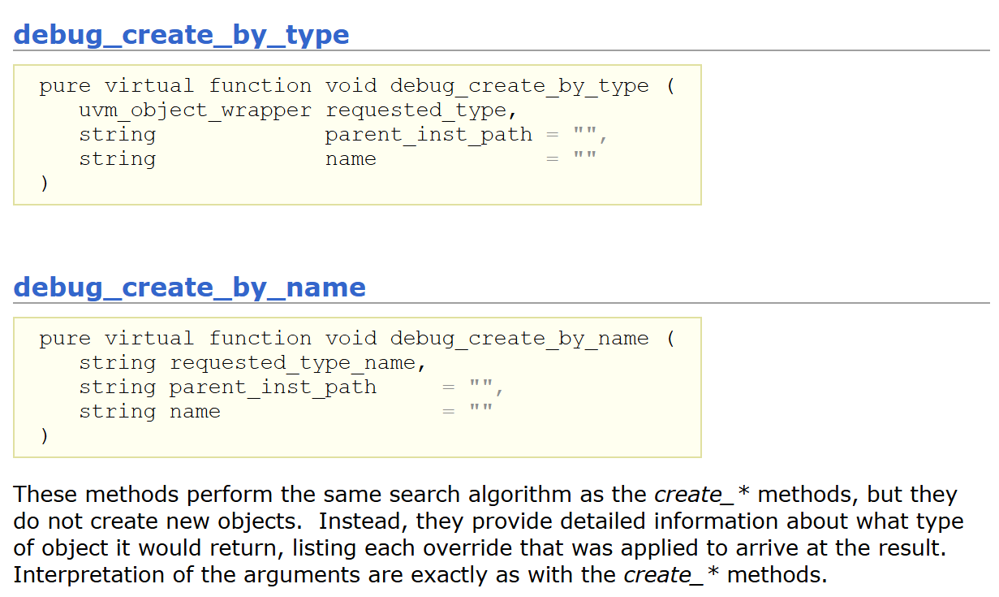
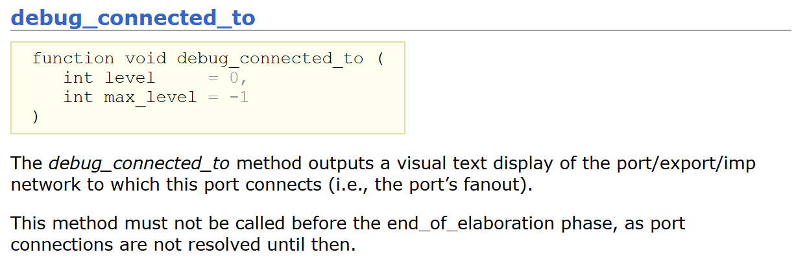
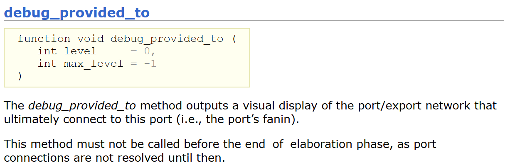
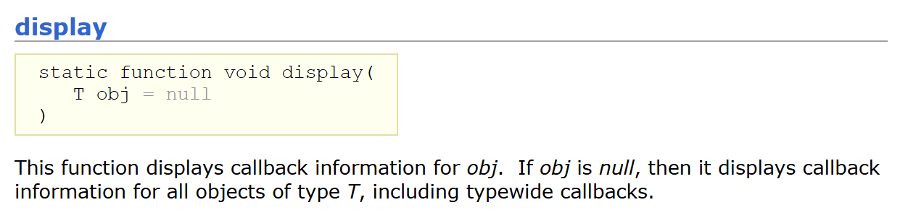
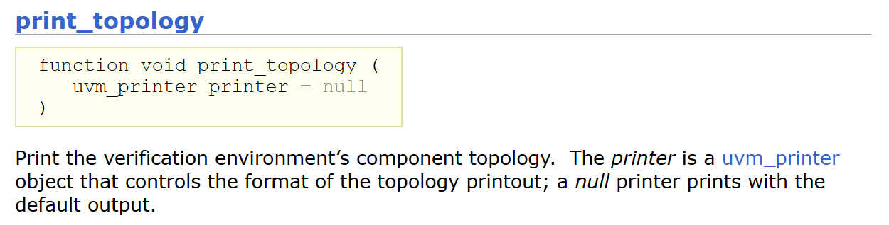

# UVM_Debugging

## Bulit-In Debug

UVM提供了一个庞大的代码库，其中UVM自带的函数和plusargs，这些功能可以帮助进行调试。

UVM 1.2和UVM1.1a中提供了调试的方法。IEEE 1800.2 LRM中没有大部分方法的记录，但是在Accellera实现的UVM 1800.2 library都得到了支持。简而言之，目前几个UVM 版本，都可以使用这部分方法进行调试。

### Configuration Debug Features

UVM Resource Database被用于将测试中的配置信息传递到测试平台。配置信息可以控制testbench，用于产生测试激励和控制测试平台的各个功能。这种机制非常强大，但它依赖于字符串匹配才能正确运行。为此，UVM提供了一些功能来帮助确保这些字符串能够匹配。

#### 1 UVM Command Line Processor

UVM Command Line Processor可用于打开跟踪消息，这些消息随后会打印出UVM_INFO消息，显示何时将信息放入资源数据库或从资源数据库中取出信息。 Command Line Processor提供了两个参数：

- +UVM_RESOURCE_DB_TRACE：uvm_resource_db API被使用时生效

  

- +UVM_CONFIG_DB_TRACE：uvm_config_db API 使用时生效

  

#### 2 UVM Component

每个从uvm_component派生的类，包括drivers, monitors, agents, env等，都带有内置函数来帮助配置和调试。这些功能可以从bulid_phase、connect_phase或者end_of_elaboration_phase时调用。



print_config打印此组件的所有配置信息，这些信息由先前对 set_config_* 的调用设置，并导出到资源池。设置按照它们的优先级顺序进行打印。如果设置了递归，那么所有子项及其以下的配置信息也会被打印出来。如果设置了审计，则会打印出每个资源的审计跟踪，包括资源名称和值。



操作与print_config相同，不同之处在于audit被强制设置为1。这个接口使得用户代码更加易于阅读，其余功能和print_config没有区别。

#### 3 Resource Database Dump

Resource Database还提供dump函数用于打印出Resource Database中当前的内容以及为每个项目存储的类型和路径。在bulid_phase、connect_phase或者end_of_elaboration_phase中调用function：

```systemverilog
 uvm_config_db #(<type>)::dump()；   //type可以为int，bit，或者其他自定义的type
```

调用后的输出大致如下： 

```
# === resource pool === 
# mem_config [/^uvm_test_top\..*mem_agent.*$/] : (class 
mem_agent_pkg::mem_config) 
# ---------------------------------- 
# Name Type Size Value 
# ---------------------------------- 
# m_mem_cfg mem_config - @552 
# ---------------------------------- 
#
# - 
# mem_interface [/^uvm_test_top$/] : (virtual mem_interface) ?
# - 
# mem_intf_mon_mp [/^uvm_test_top$/] : (virtual 
mem_interface.monitor_mp) ? 
# - 
# === end of resource pool ===
```

#### 4 Factory Debug Features

UVM Factory用于在UVM中创建对象。它还允许测试通过使用factory override来控制测试平台中“将要发生什么”的另一种机制。Factory作为一个单例对象自动创建，其中有一个名为“factory”的句柄位于uvm_pkg中。这意味着可以在这个factory单例上调用函数，以帮助了解谁已注册到factory，factory当前正在使用哪些覆盖，以及测试给定类型时factory将返回哪些对象。有三个函数提供了这些信息: 



print function打印出uvm_factory的状态，包括已注册的类型、实例覆盖和类型覆盖。

- 当 all_types 为 0 时，仅显示类型和实例覆盖。
- 当 all_types 为 1（默认值）时，如果用户定义的类型有相关联的名称，也会打印出来。
- 当 all_types 为 2 时，注册的类型列表中将包括 UVM 类型（以 uvm_ 前缀）。



这些方法执行与create_*方法相同的搜索算法，但它们不会创建新的对象。相反，它们提供了关于它将返回什么类型对象的详细信息，列出了应用于得到结果的每个override方法。

当按类型请求时，requested_type 是类型代理对象的句柄。无需预先注册。当通过名称请求时，request_type_name 是一个字符串，代表请求的类型，必须在请求之前用该名称向工厂注册。如果工厂不识别 requested_type_name，将产生一个错误并返回一个空句柄。如果提供了可选的parent_inst_path参数，那么将{parent_inst_path, ".", ~name~}连接起来，形成一个实例路径（上下文），用于搜索实例覆盖。parent_inst_path通常是通过调用父组件的uvm_component::get_full_name方法获得的。

上面三种function中最常用的是print。它以factory.print()的形式使用，返回的信息类似于以下内容，包括哪些类已经注册到工厂中，以及工厂中注册了哪些覆盖项。这些function可以从bulid_phase、connect_phase或者end_of_elaboration_phase时调用。

```
#### Factory Configuration (*)
#
# No instance overrides are registered with this factory
#
# Type Overrides:
#   Requested Type  Override Type
#   -----------------   ---------------
#   mem seq base     mem seq1
#  All types registered with the factory: 72 total
# (types without type names will not be printed)
# 
# Type Name
# ---------
# analysis_group
# coverage
# directed_test1
# environment
# mem_agent
# mem_config
# mem_driver
# mem_item
# mem_monitor
# mem_seq1
# mem_seq2
# mem_seq_base
# mem_seq_lib
# mem_trans_recorder
# questa_uvm_recorder
# scoreboard
# test1
# test_base
# test_predictor
# test_seq_lib
# threaded_scoreboard
# (*) Types with no associated type name will be printed as <unknown>
#
####
```

#### 5 Phase Debug Feature

在UVM中，由于多个phase可以并行运行，因此phase可能会让仿真变得复杂。为了帮助理解每个phase何时开始和结束，可以使用UVM command line processor来启用带有**+UVM_PHASE_TRACE**参数的跟踪。当这个参数被添加到仿真器的命令行时，会产生如下类似的输出：

```
# UVM_INFO ../uvm-1.1a/src/base/uvm_phase.svh(1364) @ 0 ns: reporter [PH/TRC/SCHEDULED] Phase 'common.run' (id=93) Scheduled from phase common.start_of_simulation

# UVM_INFO ../uvm-1.2/src/base/uvm_phase.svh(1114) @ 0 ns: reporter [PH/TRC/STRT] Phase 'common.run' (id=93) Starting phase
```

#### 6 Objection Debug Features

objection用于控制一个消耗时间的phase时结束。知道何时raise或者drop objection比较困难，特别是raise objection的数量必须与相同数量的drop objection相匹配。UVM命令行处理器可以用来启用带有+UVM_OBJECTION_TRACE附加参数的跟踪。当这个附加参数被添加到仿真器命令行时，它会产生类似于以下的输出：

```
# UVM_INFO @ 0 ns: reset_objection [OBJTN_TRC] Object uvm_test_top raised 1 objection(s) (Raising Reset Objection): count=1 total=1 
# UVM_INFO @ 0 ns: reset_objection [OBJTN_TRC] Object uvm_top added 1 objection(s) to its total (raised from source object uvm_test_top, Raising Reset Objection): count=0 total=1 
# UVM_INFO @ 80 ns: reset_objection [OBJTN_TRC] Object uvm_test_top dropped 1 objection(s) (Dropping Reset Objection): count=0 total=0 
# UVM_INFO @ 80 ns: reset_objection [OBJTN_TRC] Object uvm_test_top all_dropped 1 objection(s) (Dropping Reset Objection): count=0 total=0
```

#### 7 TLM Port Debug Features

在UVM中，组件通过TLM端口、导出和实现相互连接。UVM提供了两个可以在端口、导出或实现上调用的函数，以帮助理解哪些对象是相互连接的。只要完成了port链接即可调用，一般建议在end_of_elaboration_phase中调用函数。

> 在IEEE 1800.2中，get_connected_to()和get_provided_to()函数被重命名。在UVM的早期版本中，这两个调用被命名为debug_connected_to()和debug_provided_to()



调用get_connected_to()/debug_connected_to()的输出如下：

```
# UVM_INFO @ 0 ns: uvm_test_top.m_env.m_mem_agent.m_monitor.result_from_monitor_ap[get_connected_to]This port's fanoutnetwork: 
#
# uvm_test_top.m_env.m_mem_agent.m_monitor.result_from_monitor_ap(uvm_analysis_port)
# |
# |_uvm_test_top.m_env.m_mem_agent.m_mon_out_ap (uvm_analysis_port)
#    |
#    | uvm test top.m env.m analysis.analysis export (uvm analysis export)
#    |
#    |uvm test top.m env.m analysis.coverage h.analysis imp (uvm_analysis_imp)
#    |uvm_test_top.m_env.m_analysis.test_predictor_h.analysis_imp (uvm_analysis_imp) 
#
# Resolved implementation list:
# 0: uvm_test_top.m_env.m_analysis.coverage_h.analysis_imp (uvm_analysis_imp)
# 1: uvm_test_top.m_env.m_analysis.test_predictor_h.analysis_imp (uvm analysis imp)
```



```
# UVM_INFO @ 0 ns:uvm_test_top.m_env.m_analysis.coverage_h.analysis_imp [get_provided_to] This port's fanin network:
#
# uvm_test_top.m_env.m_analysis.coverage_h.analysis_imp (uvm_analysis_imp) 
# | 
# |_uvm_test_top.m_env.m_analysis.analysis_export (uvm_analysis_export) 
# | 
# |_uvm_test_top.m_env.m_mem_agent.m_mon_out_ap(uvm_analysis_port) 
# | 
# |_uvm_test_top.m_env.m_mem_agent.m_monitor.result_from_monitor_ap (uvm_analysis_port)
```

#### 8 Callback Debug Features

为了提高验证平台的可重用性，callback机制可以发挥巨大的作用。如果在测试平台中使用了callback，UVM可以使用display函数打印出所有当前注册的callback。



此功能应在end_of_elaboration_phase调用。例如，要显示所有注册在uvm_reg类上的回调，SystemVerilog代码将添加以下行：

```
uvm_reg_cb::display();
```

输出的内容类似：

```
# Registered callbacks for all instances of uvm_reg
# ---------------------------------------------------------------
# status_reg_h_cb on dut_rm.status_reg_h ON
# RegA_h_cb on dut_rm.RegA_h             ON
# RegB_h_cb on dut_rm.RegB_h             ON
```

编译uvm_pkg时，还存在另一个选项，可以启用回调的跟踪。在编译uvm_pkg时，可以添加**+define+UVM_CB_TRACE_ON**，这将开启类似于以下的输出：

```
UVM_INFO ../uvm-1.1a/src/base/uvm_callback.svh(1142) @ 120 ns: reporter [UVMCB_TRC] Callback mode for status_reg_h_cb is ENABLED : callback status_reg_h_cb (uvm_callback@837)
```

#### 9 General Debug Feature

##### 打印测试平台的层次结构

要打印出测试平台当前的组件层次结构，可以调用print_topology()函数。函数可以end_of_elaboration_phase调用。



此外uvm_root class中有一个bit enable_print_topology(默认为0)，如果设置为1，可以在end_of_elaboration_phase之后打印整个验证环境的拓扑结构。
